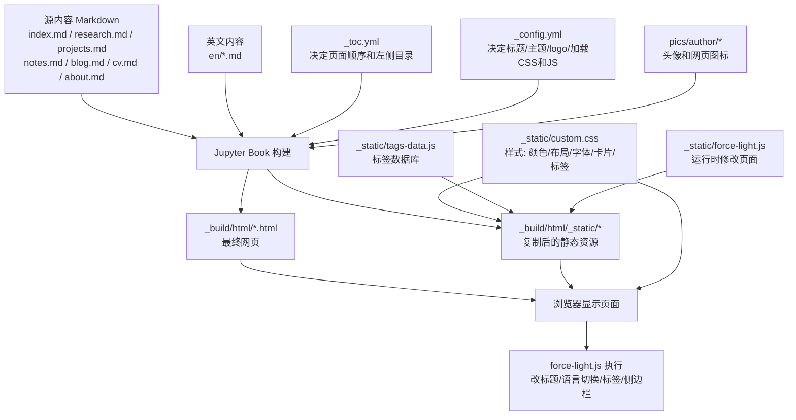
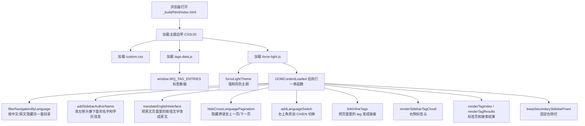
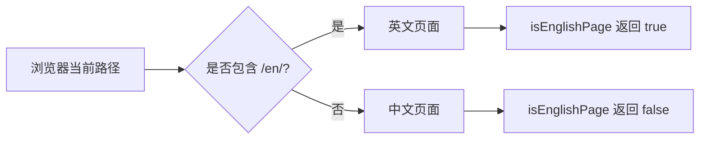
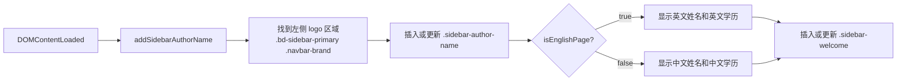
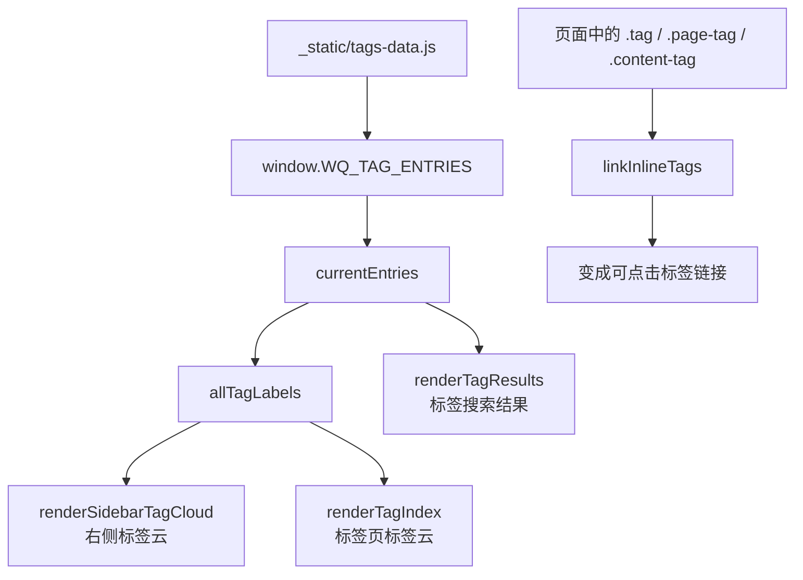
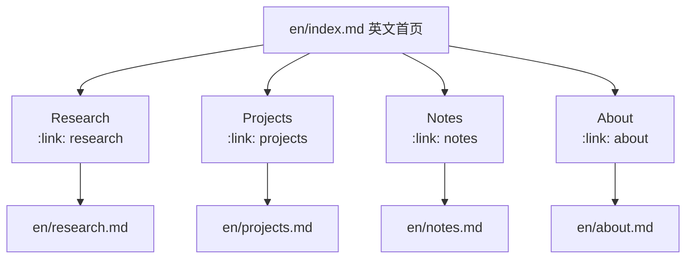
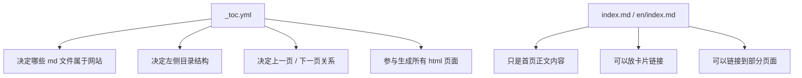
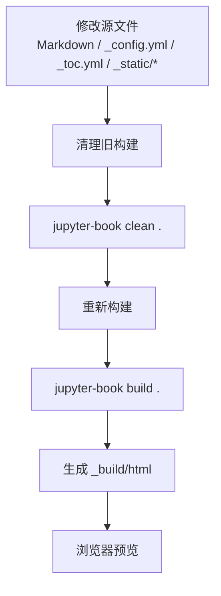

# 项目架构说明

这个项目是一个 Jupyter Book 网站。核心关系可以理解为：

> 你写 Markdown 和配置，Jupyter Book 生成网页；然后 `_static/custom.css` 负责“长什么样”，`_static/force-light.js` 负责“打开网页后再改页面结构和文字”。

## 整体架构图



## 运行时调用关系



## 文件职责表

| 你想改什么 | 改哪个文件 |
|---|---|
| 页面正文内容 | `index.md`, `research.md`, `projects.md`, `notes.md`, `blog.md`, `cv.md`, `about.md` |
| 英文页面正文 | `en/index.md`, `en/research.md` 等 |
| 左侧目录顺序、章节标题 | `_toc.yml` |
| 网站标题、作者、logo、加载哪些 CSS/JS | `_config.yml` |
| 颜色、字体、间距、卡片、标签样式 | `_static/custom.css` |
| 左侧头像下方名字、学历、语言切换、标签渲染 | `_static/force-light.js` |
| 标签页里的数据、标签对应文章 | `_static/tags-data.js` |
| 头像图片 | `pics/author/avat.jpg` |
| 浏览器 tab 图标 | `pics/author/icon.png` |
| 最终网页 | `_build/html`，这是构建产物，通常不要手改 |

## 中英文页面如何区分

`_static/force-light.js` 里有这个函数：

```js
const isEnglishPage = () =>
  window.location.pathname.replaceAll("\\", "/").includes("/en/");
```

它通过当前网页路径里是否包含 `/en/` 判断当前页面是不是英文页面。



很多函数都会依赖这个判断，例如：

- `addSidebarAuthorName()`：决定左侧显示中文姓名还是英文姓名，显示中文学历还是英文学历。
- `filterNavigationByLanguage()`：中文页面隐藏英文目录，英文页面隐藏中文目录。
- `addLanguageSwitch()`：决定右上角按钮显示 `CH` 还是 `EN`。
- `renderSidebarTagCloud()`：决定标签云显示中文标签还是英文标签。

## 左侧头像下方信息的调用关系

你之前修改的“博士 机械工程 / 哈尔滨工业大学”就在 `_static/force-light.js` 的 `addSidebarAuthorName()` 函数里。



对应逻辑大致是：

```js
const welcomeLines = isEnglishPage()
  ? ["PhD Mechanical Engineering", "Harbin Institute of Technology"]
  : ["博士 机械工程", "哈尔滨工业大学"];
```

如果想改这里的文字，就改这两行数组里的内容。

## 标签系统如何工作

标签相关内容由两个文件合作完成：

- `_static/tags-data.js`：保存所有标签数据。
- `_static/force-light.js`：读取标签数据，然后渲染标签云和标签结果页。



如果你想新增一个标签，通常要做两件事：

1. 在 Markdown 页面里写出标签元素，比如 `<span class="tag">机器学习</span>`。
2. 在 `_static/tags-data.js` 里给对应页面增加或修改 tags 数据。

## Markdown 页面如何连接

这些 `.md` 文件不是被主页 `index.md` 直接“调用”生成全站的。真正把它们串起来的是 `_toc.yml`。

Jupyter Book 先读取 `_toc.yml`：

```yaml
format: jb-book
root: index
```

这里的 `root: index` 表示：

```text
index.md 是中文站点的根页面 / 首页
```

然后 `_toc.yml` 里的章节会继续声明其他页面：

```yaml
chapters:
  - file: research
  - file: projects
  - file: notes
  - file: blog
  - file: cv
  - file: about
  - file: tags
```

这些 `file` 字段会对应到项目根目录里的 Markdown 文件：

| `_toc.yml` 里的写法 | 源文件 | 构建后的网页 |
|---|---|---|
| `file: research` | `research.md` | `_build/html/research.html` |
| `file: projects` | `projects.md` | `_build/html/projects.html` |
| `file: notes` | `notes.md` | `_build/html/notes.html` |
| `file: blog` | `blog.md` | `_build/html/blog.html` |
| `file: cv` | `cv.md` | `_build/html/cv.html` |
| `file: about` | `about.md` | `_build/html/about.html` |
| `file: tags` | `tags.md` | `_build/html/tags.html` |

英文页面也是同样逻辑：

| `_toc.yml` 里的写法 | 源文件 | 构建后的网页 |
|---|---|---|
| `file: en/index` | `en/index.md` | `_build/html/en/index.html` |
| `file: en/research` | `en/research.md` | `_build/html/en/research.html` |
| `file: en/projects` | `en/projects.md` | `_build/html/en/projects.html` |
| `file: en/notes` | `en/notes.md` | `_build/html/en/notes.html` |
| `file: en/blog` | `en/blog.md` | `_build/html/en/blog.html` |
| `file: en/cv` | `en/cv.md` | `_build/html/en/cv.html` |
| `file: en/about` | `en/about.md` | `_build/html/en/about.html` |
| `file: en/tags` | `en/tags.md` | `_build/html/en/tags.html` |

所以，全站页面关系主要在 `_toc.yml` 里连接。

## 首页卡片如何链接页面

主页 `index.md` 里还有一些卡片入口。它们不是全站目录，而是首页正文里的快捷链接。

例如 `index.md` 里这种写法：

```md
:::{grid-item-card} 研究
:link: research
:link-type: doc

展示我的博士研究方向、柔性机械手力感知问题、建模方法、实验平台和论文工作。
:::
```

其中：

```md
:link: research
:link-type: doc
```

表示链接到 Jupyter Book 文档 `research.md`。构建后会变成网页链接：

```text
research.html
```

中文首页当前主要卡片关系可以理解为：


英文首页 `en/index.md` 也有类似结构：

```md
:::{grid-item-card} Research
:link: research
:link-type: doc
```

因为这个文件本身在 `en/` 文件夹里，所以这里的 `research` 指的是：

```text
en/research.md
```

英文首页卡片关系可以理解为：



## `_toc.yml` 和首页链接的区别



简单说：

| 位置 | 作用 |
|---|---|
| `_toc.yml` | 全站级目录，决定哪些 Markdown 页面会被构建进网站 |
| `index.md` | 中文首页正文，可以放介绍、卡片、标签和跳转入口 |
| `en/index.md` | 英文首页正文，可以放英文介绍、卡片、标签和跳转入口 |

## 构建和预览流程

推荐只改源文件，然后重新构建。



PowerShell 命令：

```powershell
conda activate jupyterbook
Set-Location "Q:\daydream\JoanWu\quarto-template"
jupyter-book clean .
jupyter-book build .
```

本地预览：

```powershell
python -m http.server 8000 --directory _build\html
```

然后打开：

```text
http://localhost:8000
```

## 修改时的原则

优先改这些源文件：

```text
_static/force-light.js
_static/custom.css
_static/tags-data.js
*.md
en/*.md
_toc.yml
_config.yml
```

尽量不要直接改：

```text
_build/html
```

因为 `_build/html` 是构建产物。你下一次运行 `jupyter-book build .` 时，它里面的内容可能会被重新生成并覆盖。

如果你只是想临时看效果，可以手动同步 `_static` 到 `_build/html/_static`，但正式修改应以源文件为准。
