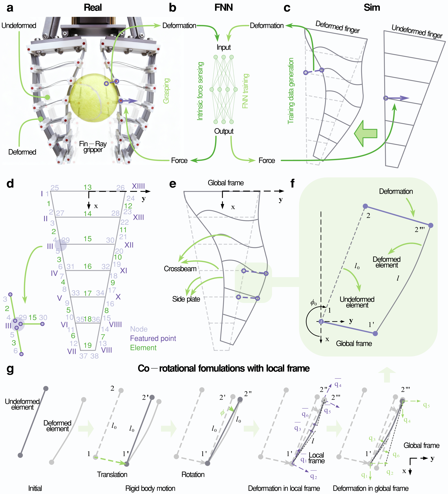
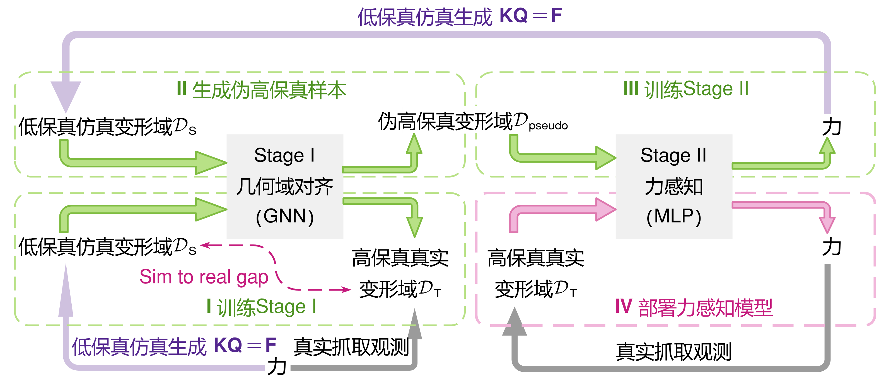
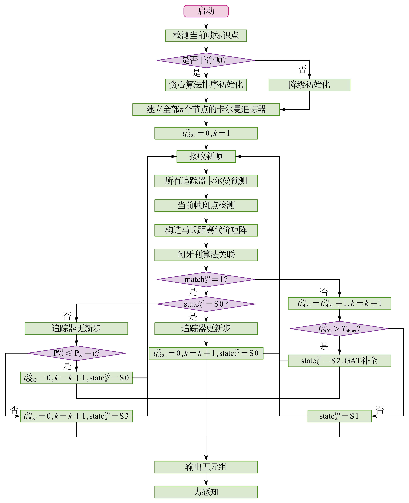

# 机器人柔性机械手接触力感知与Sim-to-Real迁移方法研究

  柔性机械手
  机器学习
  非接触式力感知
  逆问题求解
  机器学习与深度学习
  Sim-to-real gap
  AI for science
  运动学与静力学建模

:::{admonition} 核心问题
:class: note
- 柔性机械手传感器布置困难
- 采集数据成本高
- 仿真模型与真实实验之间存在Sim-to-Real gap
- 逆问题求解存在容易奇异的问题
:::

## 基于模型的力感知方法

  局部标架共旋模型
  有限元
  MLP
  最小二乘法
  贪心算法

但是由于材料的非线性，随着受力增大，变形增大，材料非线性行为越发明显，仿真模型与真实实验之间的偏差增大。

## 多保真度变形域对齐的力感知方法

考虑利用少量真实数据校正仿真中的偏差，生成伪高保真数据，训练模型，进行力感知。

  有限元
  MLP
  GNN
  Sim-to-Real gap
  域对齐

## 部分观测失效下的力感知及其不确定性量化

  GAT
  卡尔曼

[返回上一级](../projects.md)